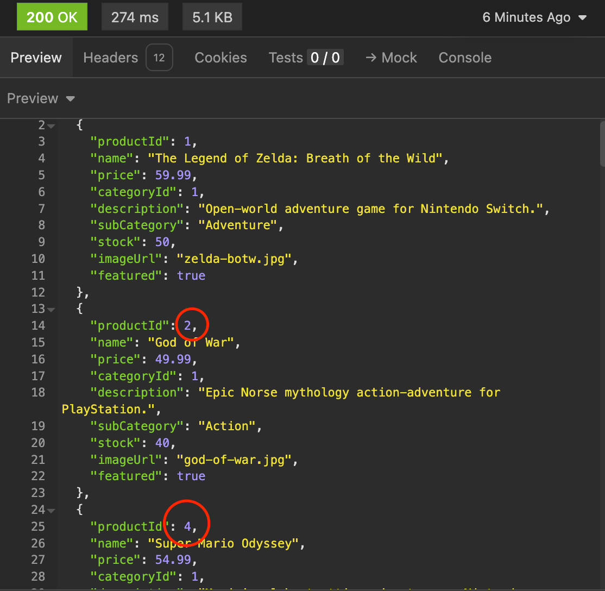
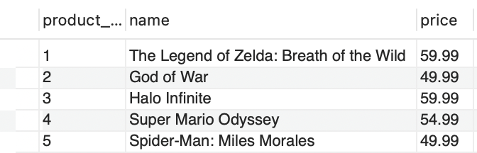
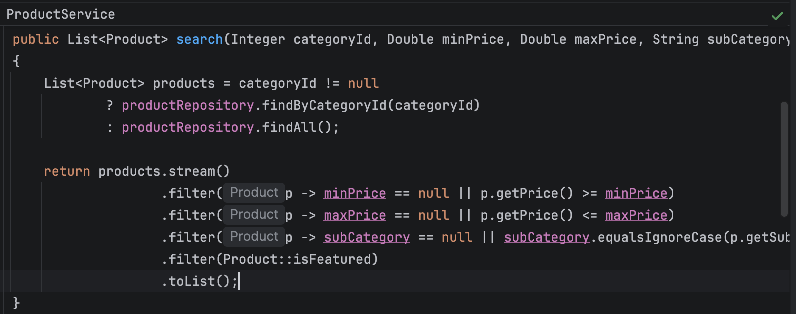

# BUG 1

# Title: All products are not displayed when GET request w/ URL /products

# Environment:
- MacOS Tahoe 26.5.1
- IntelliJ 2026.1 (server, on my Mac)
- Insomnia 13.0.2 (HTTP requests, on my Mac)
- MySQL server 8.0.46-arm64 + workbench (on my Mac)

# Reproduce:
Use Insomnia to send a GET request to the API server at the URL http://127.0.0.1:8080/products

# Expected:
Server should send back JSON data for all products in the database (currently IDs 1-62)

# Actual Results:
Server sends a list excluding IDs 3, 5, 7-8, 10-11, 14-16, 18-19, 21, 26-29, 31-32, 34-36, 38-39, 42, 44, 47-49, 51-56, 58-61

# Notes:

- All products that aren’t featured do not appear
- This line appears to be responsible?
  

- (.filter(Product::isFeatured) is asking the stream to be filtered so that only isFeatured() == true products remain)
- creating a unit test to test hypothesis and later test solution
- Test failed “org.opentest4j.AssertionFailedError: list was empty, only featured products appeared ==>
  Expected :false
  Actual   :true”
- Will update code to include games that aren’t featured in the full list
- Updated code to remove this line and confirmed by testing with and without the line that this line was the source of the bug

