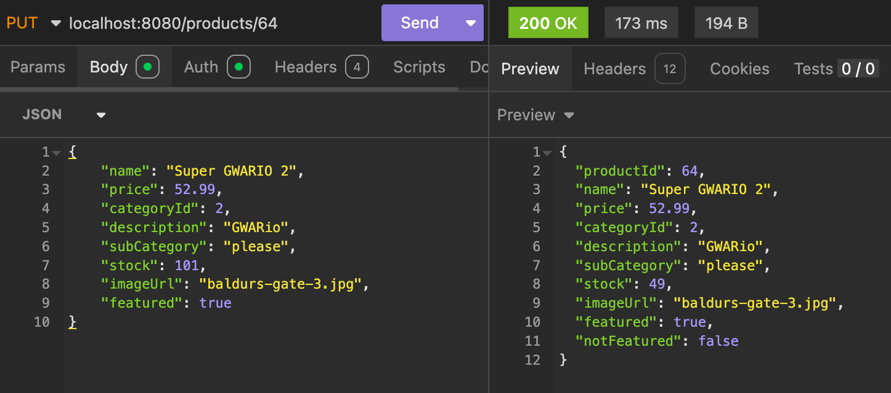
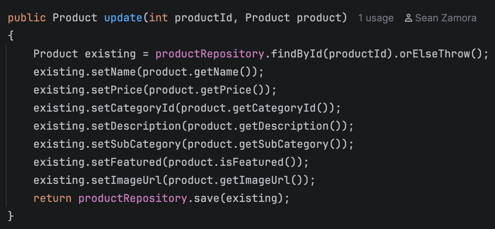

# BUG 2

# Title: Stock is not changed when updated via PUT request

# Environment: 
- MacOS Tahoe 26.5.1
- IntelliJ 2026.1 (server, on my Mac)
- Insomnia 13.0.2 (HTTP requests, on my Mac)
- MySQL server 8.0.46-arm64 + workbench (on my Mac)

# Reproduce:
Use Insomnia to send a PUT request w/ URL http://127.0.0.1:8080/products/(id) number to test goes here, I used 64 and made a new product), put all required fields into the JSON body and notice that the body of the reply’s stock field is not changed

# Expected: 
Stock field should be updated when PUT request is authorized

# Actual Results:
JSON returned by server does not show updated stock count, database is not updated either

# Notes:

- It appears that the issue is probably that we are missing one line of code in update() for ProductService. 

- In this case I imagine stock would not update unless there was a “existing.setStock(product.getStock());” line
- I will make another unit test to test this hypothesis
- Testing confirms that update() does not update stock. 

